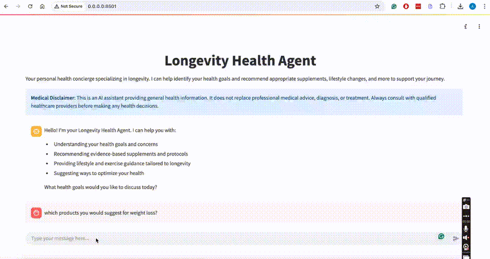

# Longevity Health Agent 🧬

A personalized AI-powered health concierge specializing in longevity and wellness. This application provides tailored health recommendations, supplement suggestions, and lifestyle guidance to help you optimize your health and longevity.

## Features

- 🤖 AI-powered health consultation
- 💊 Personalized supplement recommendations
- 🏃‍♂️ Lifestyle and exercise guidance
- 🎯 Goal-oriented health planning
- 🔒 Secure session management
- 💬 Interactive chat interface

## Demo

Watch a quick demo of the Longevity Health Agent interface:




## Tech Stack

- **Frontend**: Streamlit
- **Backend**: FastAPI
- **AI**: OpenAI
- **Python Version**: >=3.11

## Prerequisites

- Python 3.11 or higher
- pip or uv package manager

## Installation

1. Clone the repository:
```bash
git clone https://github.com/yourusername/Longevity_check.git
cd Longevity_check
```

2. Create and activate a virtual environment:
```bash
python -m venv venv
source venv/bin/activate  # On Windows: venv\Scripts\activate
```

## Usage

1. Start the backend server:
```bash
cd backend
uvicorn main:app --reload
```

2. In a new terminal, start the Streamlit frontend:
```bash
streamlit run app.py
```

3. Open your browser and navigate to `http://localhost:8501`

## Project Structure

```
Longevity_check/
├── app.py              # Streamlit frontend application
├── backend/           # FastAPI backend server
├── venv/             # Python virtual environment
├── attached_assets/  # Project assets
├── pyproject.toml    # Project dependencies
└── README.md         # Project documentation
```

## Medical Disclaimer

This application is an AI assistant providing general health information. It does not replace professional medical advice, diagnosis, or treatment. Always consult with qualified healthcare providers before making any health decisions.


